# AI English Hub

Production-oriented EduTech monorepo for Vietnamese students learning English (and school subjects) with multimodal AI.

**Stack:** Next.js · Spring Boot microservices · PostgreSQL · Redis · Kafka · Qdrant · Ollama · LangGraph · LlamaIndex-style RAG · Docker · SSE (inbox + classroom chat + tutor stream)

## Demo screenshots

Captured from the local Docker stack (`localhost:3000`). Regenerate (stack must be up):

```powershell
npm install --no-save playwright@1.49.0
npx playwright install chromium
node scripts/capture-demo-screens.mjs
```

### Landing & auth


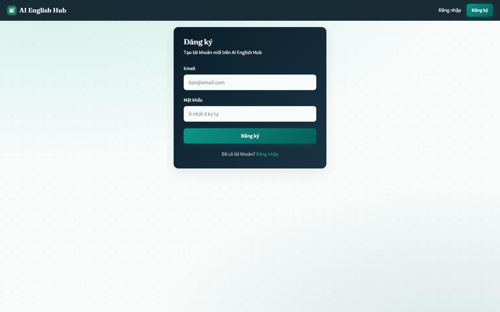

### Home hub (teacher)

After login, both roles land on **`/home`** (left rail). `/dashboard` redirects here. Classroom list pages `/teacher/classrooms` and `/student/classrooms` redirect to `/home?tab=classrooms`.

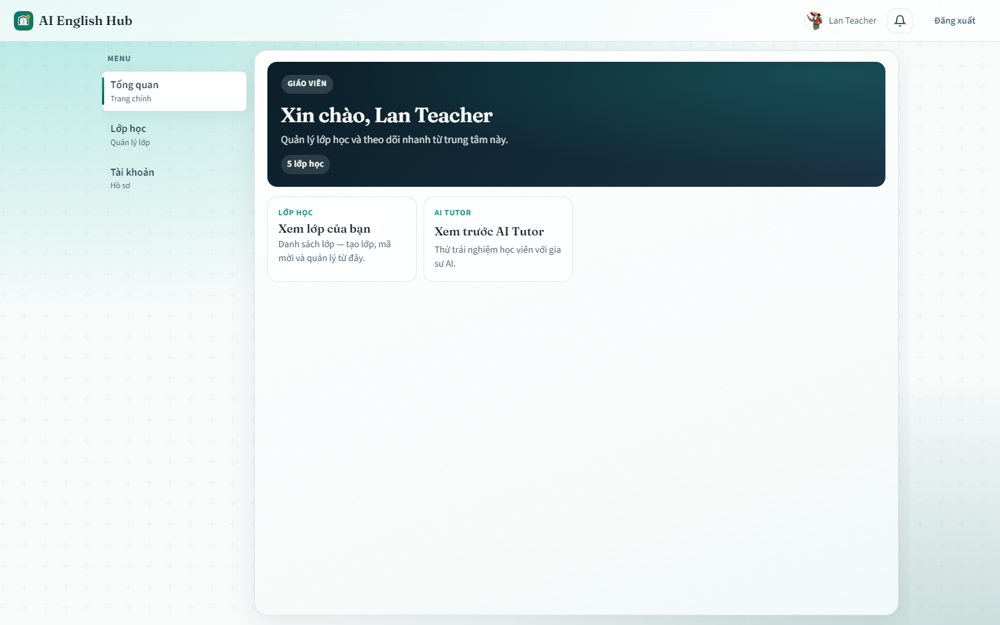

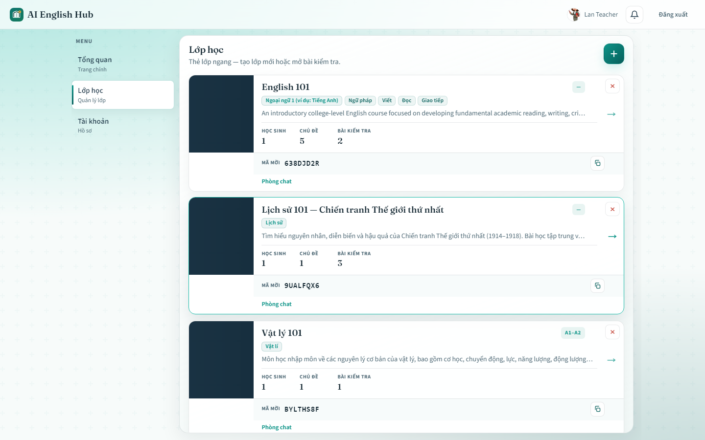

### Realtime notifications (SSE)

Teacher inbox with one-click **Accept / Reject** on join requests (no reason prompt). Refresh and mark-read are icon actions; long lists use pagination. Students also receive **exam scheduled / starting soon** reminders.

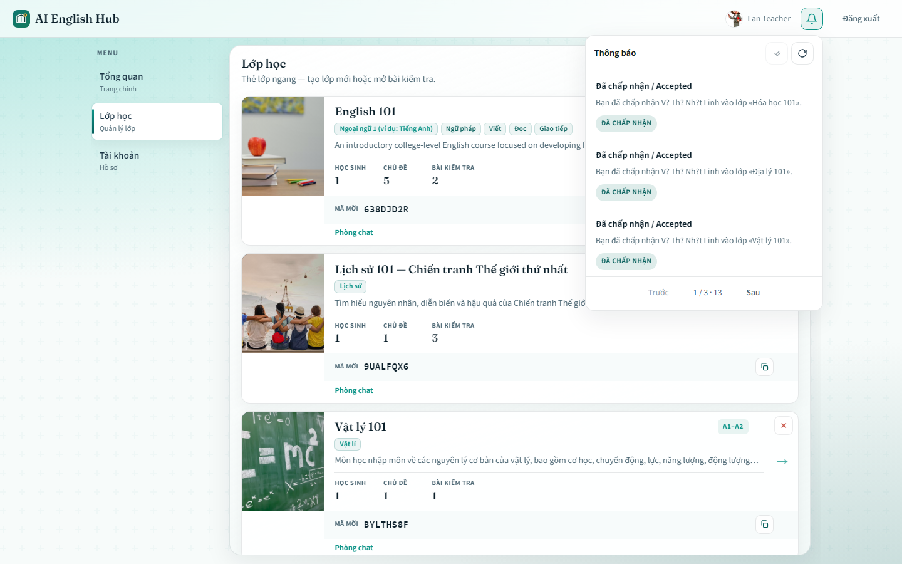

### Classroom chat (teacher)

One room per class. Text (unbounded length), attachments, emoji, pin, edit own messages, shadcn delete confirm (teacher/admin). Live via SSE.

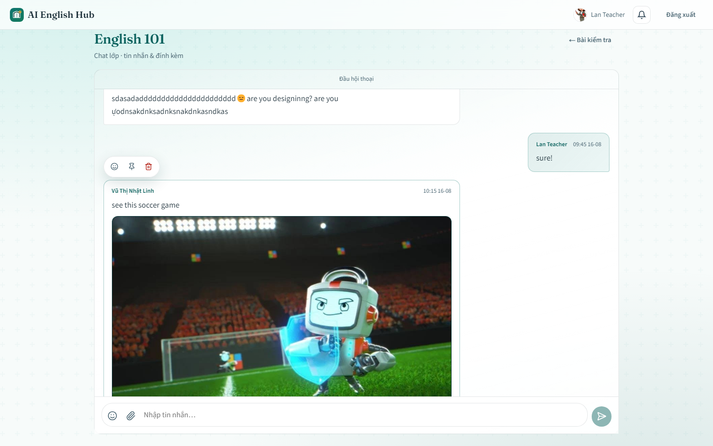

### Quizzes (teacher)

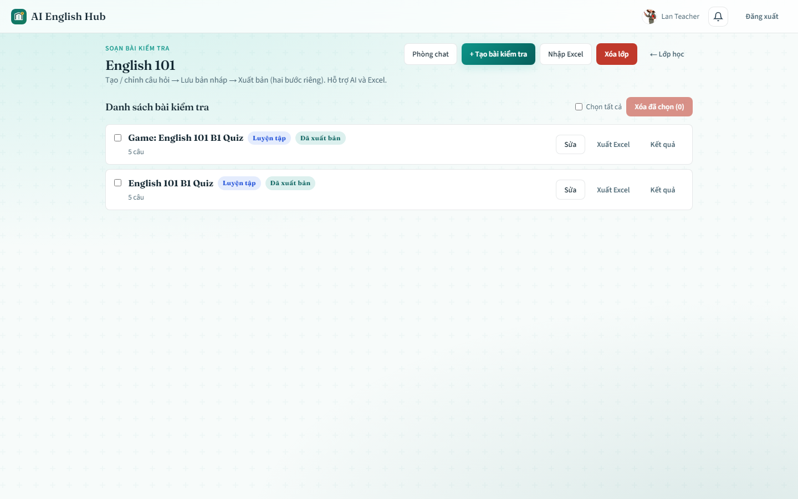

### Home hub (student)

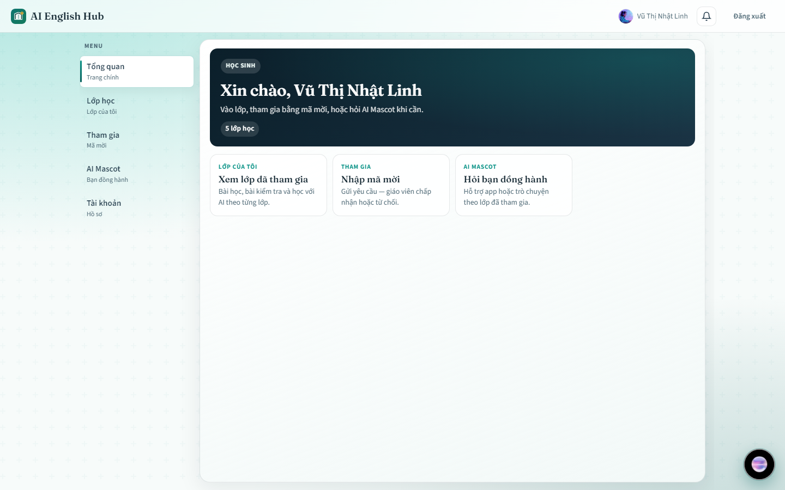

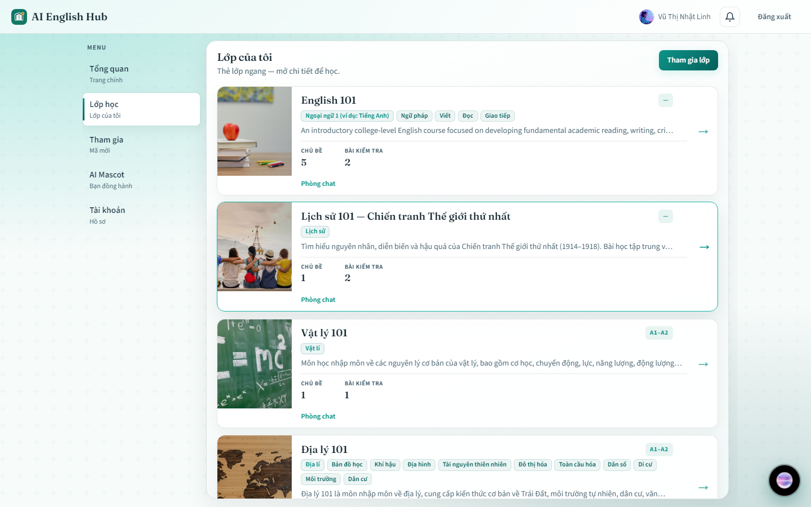


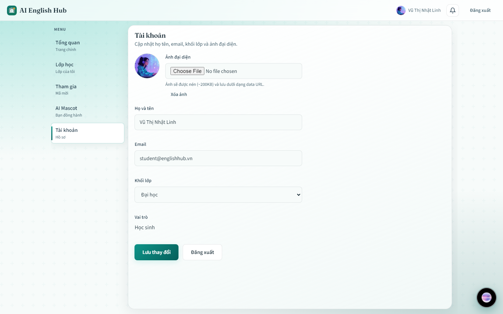

### Classroom chat (student)

Same room as the teacher. Students can send, react, pin, and edit their own messages (delete is teacher/admin only).

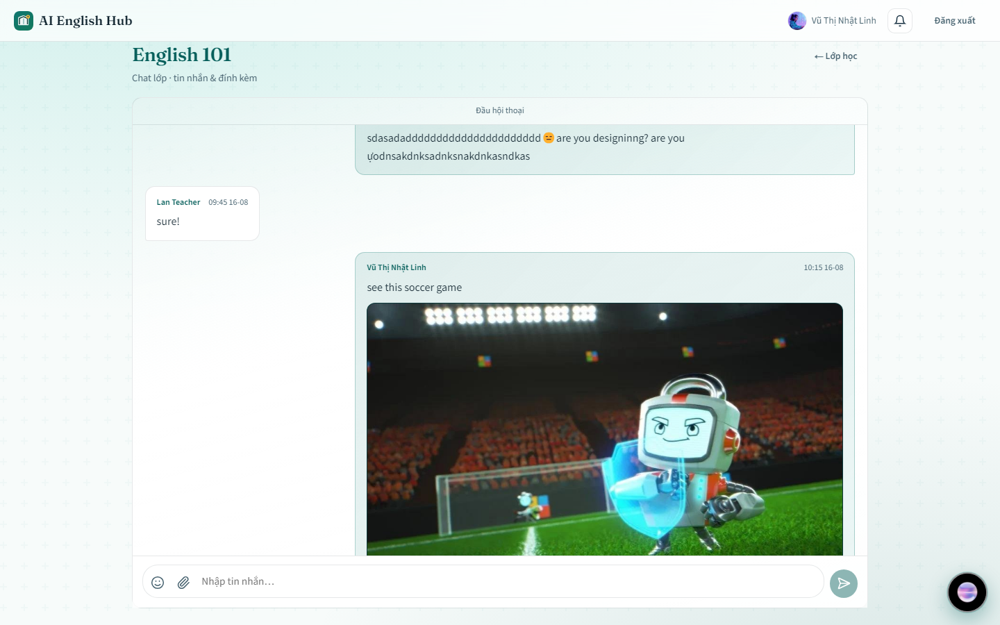

### Classroom & exams (student)

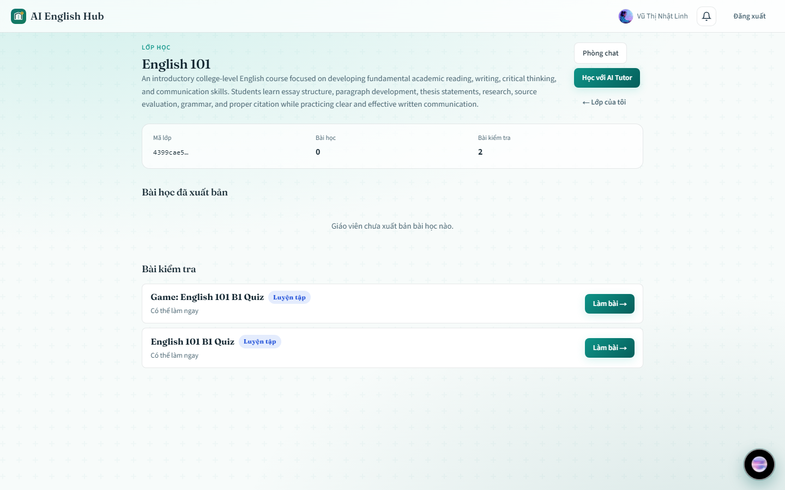

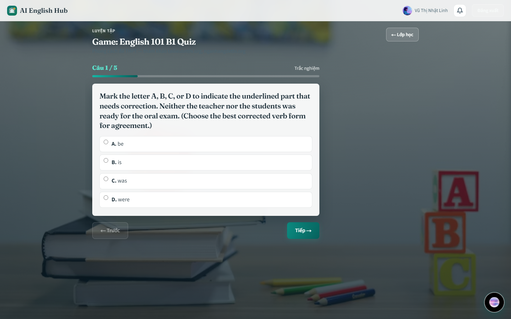

## Product UX (current)

### Home hub — `/home`

Single app shell with a **left rail** (`?tab=`):

| Tab | Teacher / Admin | Student |
|---|---|---|
| **Tổng quan** (`overview`) | Quick tiles → classrooms (and tutor preview for teachers) | Tiles → classrooms, join, AI Mascot |
| **Lớp học** (`classrooms`) | Manage / create classes | Joined classes |
| **Tham gia** (`join`) | — | Invite-code join request |
| **AI Mascot** (`mascot`) | — | Embedded chat (+ floating mascot on other tabs) |
| **Tài khoản** (`account`) | Profile edit | Profile edit |

- `/dashboard` → `/home`
- `/teacher/classrooms` and `/student/classrooms` → `/home?tab=classrooms` (no duplicate list UIs)
- Shared **pagination** (`PaginationBar`) on classroom lists, notification inbox, and teacher quiz lists

### Classrooms

Horizontal cards show: **cover**, **title**, **description**, **level** (CEFR / band when inferred), **students**, **subjects + knowledges** (all topic chips; **Khác / Other** hidden), **exam count**, and for teachers **invite code + copy**.

**Create classroom** (modal):

- AI / heuristic **subject + knowledges** from description (`/api/v1/ai/detect-subject`)
- Subject picker aligned with **Lớp 12**-style curriculum groups (Ngữ văn, Toán, Ngoại ngữ, KHTN, KHXH, Công nghệ & nghệ thuật, IELTS/TOEIC, …)
- Cartoon cover: preset / upload / AI generate + **crop** dialog

Teachers open a class → quiz authoring; students open a class → lessons, published exams, tutor deep-link.

**Classroom chat** (one room per class — teacher + enrolled students):

- Teacher: **Phòng chat** from home classroom cards, `/teacher/classrooms/[id]/quizzes`, or `/teacher/classrooms/[id]/chat`
- Student: **Phòng chat** from home cards, `/student/classrooms/[id]`, or `/student/classrooms/[id]/chat`
- Unbounded text (composer + edit auto-grow); image / video / file attachments (data-URL MVP, ~3–5MB)
- Emoji picker in composer; emoji reactions (quick set + full list)
- Pin / unpin (any member); **edit own** messages; **soft-delete** (TEACHER/ADMIN) with shadcn **AlertDialog** confirm (not `window.confirm`)
- UTF-8 display names via gateway `X-User-Name` encoding
- Live updates via classroom SSE (`message` / `message_edited` / `pin` / `message_deleted` / `reaction`) + short poll fallback

### Quizzes / exams

Three **kinds** on `Quiz.kind` (API / DB):

| Kind | Label | Behavior |
|---|---|---|
| **EXAM** | Bài kiểm tra | Timed window (`startsAt` + `durationMinutes` → `endsAt`); reminder minutes before start; one graded attempt; student UI shows lock / countdown until open |
| **PRACTICE** | Luyện tập | Anytime classic MCQ take UI |
| **GAME** | *(legacy)* | Kept in the API enum for existing rows; product UI treats it like **PRACTICE** (classic take-exam). Teachers can no longer create GAME quizzes. |

Question banks are **internal + AI** styled after THPT / HSA-style subjects (inspired by [tailieuonthi.org](https://tailieuonthi.org/) and [nganhangdethi.org](https://www.nganhangdethi.org/)). Attribution may appear as `sourceLabel` / generate-quiz `attribution` — **no live PDF scrape**.

**Teacher** (`/teacher/classrooms/[id]/quizzes`):

- Kind picker (**EXAM** / **PRACTICE**) + EXAM schedule fields (start, duration, reminder)
- Create/edit **draft** quizzes; **Publish** is a separate action (students only see `PUBLISHED`)
- **AI MCQ generate** via `/api/v1/ai/generate-quiz` with `kind` (fast heuristic by default; Ollama optional)
- **Excel** `.xlsx` **import** (→ draft) and **export**
- List badges by kind + status; bulk / single delete; attempt results; optional **delete classroom**

**Student** (`/student/classrooms/[id]` and `.../quizzes/[quizId]`):

- Kind badges; EXAM locked / countdown until `startsAt`, closed after `endsAt` (server also time-gates)
- **PRACTICE / EXAM** (and legacy **GAME**): one question per screen (Tiếp / Trước / Nộp bài), classroom cover background, fireworks on perfect score
- Inbox: **exam scheduled** when the teacher publishes an EXAM; **starting soon** reminder (`reminderMinutesBefore`)

### AI Mascot / Tutor

- Two modes: **Hỗ trợ app** (how to use the product) and **Theo lớp** (class-bound tutor)
- Class-bound chat with **history** (last turns sent to the API)
- **Streaming** replies (`POST /api/v1/ai/tutor/stream`, SSE)
- Multimodal: **text↔image**, **image→text** (vision), **text→video**, **speak→text** (browser STT + server fallback), **speak→image**
- Vietnamese responses when the user / class context is Vietnamese; English-focused for English/IELTS/TOEIC subjects
- Students: home tab **AI Mascot** + floating host; full surface also at `/student/tutor`

### Account — `/home?tab=account`

Edit **full name**, **email**, **grade** (Lớp 6–12 / Đại học / …), and **avatar** (`PATCH /api/v1/auth/profile`).

### Register — `/register`

**Email + password** only → defaults to **`STUDENT`**. Display name derived from email local-part (editable later in Account). Teachers use seeded demos or admin assignment — not self-selected on register.

## Quick start (Docker)

Prerequisites:
1. [Docker Desktop](https://www.docker.com/products/docker-desktop/)
2. **WSL 2** (required on Windows — without it you get `500 Internal Server Error` from the Docker engine)
3. Docker Desktop status: **Engine running**

If `docker compose up --build` fails with API 500 / engine errors, run an **Admin** PowerShell once:

```powershell
cd "c:\Users\LvLin\OneDrive\Documents\AI\AI English Hub & Multimodal App"
Set-ExecutionPolicy -Scope Process Bypass -Force
.\scripts\fix-docker-windows.ps1
# Reboot if WSL was just installed, then open Docker Desktop and wait for Engine running
```

Then build & start **detached** (recommended — avoids endless container log spam):

```powershell
cd "c:\Users\LvLin\OneDrive\Documents\AI\AI English Hub & Multimodal App"
copy .env.example .env
.\scripts\up.ps1 -Build
# or: docker compose up -d --build
```

Optional MinIO object storage:

```powershell
docker compose --profile storage up -d
```

Follow only the services you care about:

```powershell
docker compose logs -f --tail=80 web gateway
```

| Surface | URL |
|---|---|
| Web app | http://localhost:3000 |
| **Swagger hub (all APIs)** | http://localhost:8080/swagger-ui.html |
| API Gateway | http://localhost:8080 |
| Postgres | localhost:5432 |
| Redis | localhost:6379 |
| Kafka | localhost:9092 |
| Qdrant | http://localhost:6333 |
| Ollama | http://localhost:11434 |
| Notification (direct) | http://localhost:8085 |
| MinIO console (profile `storage`) | http://localhost:9001 |

Models are pulled automatically by `ollama-init` on `docker compose up`.  
If you need a manual pull (and `docker compose exec` fails with Docker API 500), use HTTP instead:

```powershell
# Restart Docker Desktop if you see: "request returned 500 Internal Server Error"
docker compose up -d ollama
.\scripts\pull-models.ps1
```

Full Swagger guide: [`docs/swagger.md`](docs/swagger.md)

### Demo accounts

| Role | Email | Password |
|---|---|---|
| Admin | `admin@englishhub.vn` | `Password123!` |
| Teacher | `teacher@englishhub.vn` | `Password123!` |
| Student | `student@englishhub.vn` | `Password123!` |

### Smoke flow

1. Login as **teacher** → `/home` → **Lớp học** → create classroom (AI subject/knowledges + cover) → **copy invite code**
2. Login as **student** → `/home` → **Tham gia** → join with invite code
3. Teacher **Accept / Reject** from the **notification bell** (or pending join list)
4. Teacher opens class → create quiz (**EXAM / PRACTICE** + AI generate and/or Excel) → **save draft** → **Publish** (EXAM needs start + duration)
5. Open **Phòng chat** (teacher + student) — send text/attachments, react, pin, edit; teacher can delete via the confirm dialog
6. Student opens class → take PRACTICE/EXAM (one question per screen) → perfect score shows fireworks
7. Student opens **AI Mascot** (or `/student/tutor`) — app help or class-bound multimodal chat

### Ops tips

**DBeaver → Postgres (Docker):** host `localhost`, port `5432`, user/password from `.env` (defaults `englishhub` / `englishhub`). Connect to a **service DB** (e.g. `identity_db`, `classroom_db`, `assessment_db`) — not only the bootstrap `POSTGRES_DB`. See `infra/docker/postgres/init-databases.sql`.

**Kafka `NodeExists` on recreate:** if Kafka exits with ZooKeeper `NodeExists` on `/brokers/ids/1` (stale broker registration), recycle broker + ZK only — **do not wipe Postgres**:

```powershell
docker compose stop kafka zookeeper
docker compose rm -f kafka zookeeper
docker compose up -d zookeeper
# wait until healthy, then:
docker compose up -d kafka
docker compose up -d
```

## Services

Compose inventory (`docker-compose.yml`) — **every container**:

| Layer | Service | Image / build | Port | Role |
|---|---|---|---|---|
| Edge | `gateway` | `gateway/Dockerfile` (Spring Boot 3.4 WebFlux) | **8080** | JWT, routing, Swagger hub, SSE proxy, 16MB JSON |
| Web | `web` | `apps/web/Dockerfile` (Next.js 15 standalone) | **3000** | Home hub, chat, quizzes, exam, mascot |
| Domain | `identity-service` | Spring Boot MVC | 8081 | Auth, JWT, profile, Redis sessions |
| Domain | `classroom-service` | Spring Boot MVC | 8082 | Classrooms, join, members, **chat SSE** |
| Domain | `content-service` | Spring Boot MVC | 8083 | Lessons + publish |
| Domain | `assessment-service` | Spring Boot MVC | 8084 | Quizzes, Excel, attempts, exam schedule events |
| Domain | `notification-service` | Spring Boot MVC | **8085** | Inbox SSE, Kafka consumers, exam reminders |
| AI | `ai-orchestration` | FastAPI | 8090 | LangGraph tutor, detect-subject, generate-quiz |
| AI | `ai-rag` | FastAPI | 8091 | Chunk/embed + Qdrant retrieve |
| AI | `ai-multimodal` | FastAPI | 8092 | STT / vision / image / video helpers |
| Models | `ollama` | `ollama/ollama` | **11434** | Private LLM runtime |
| Models | `ollama-init` | `curlimages/curl` | — | One-shot `api/pull` (`llama3.2`, `llama3.2:1b`, `nomic-embed-text`) |
| Data | `postgres` | `postgres:16-alpine` | **5432** | One logical DB per service |
| Data | `redis` | `redis:7-alpine` | **6379** | Refresh tokens / sessions |
| Data | `zookeeper` | `cp-zookeeper:7.6.1` | 2181 | Kafka coordination |
| Data | `kafka` | `cp-kafka:7.6.1` | **9092** / 29092 | Domain events |
| Data | `qdrant` | `qdrant/qdrant:v1.13.2` | **6333** | Vector store `lesson_chunks` |
| Optional | `minio` | `minio/minio` (profile `storage`) | **9000** / **9001** | S3-compatible object storage |

CI (not Compose): GitHub Actions — Node 22 web build, Java 21 Maven, Python 3.12 `compileall`.

Planned later: `game-service`, `progress-service`, `media-service` (see [`services/README.md`](services/README.md)). Postgres already creates placeholder DBs `progress_db` / `media_db` / `rag_meta_db`.

## Architecture

End-to-end drawings. **Every Compose server** is on Docker network `hub`. Ollama is **internal only** (not a public gateway route).

### 1. All servers and services

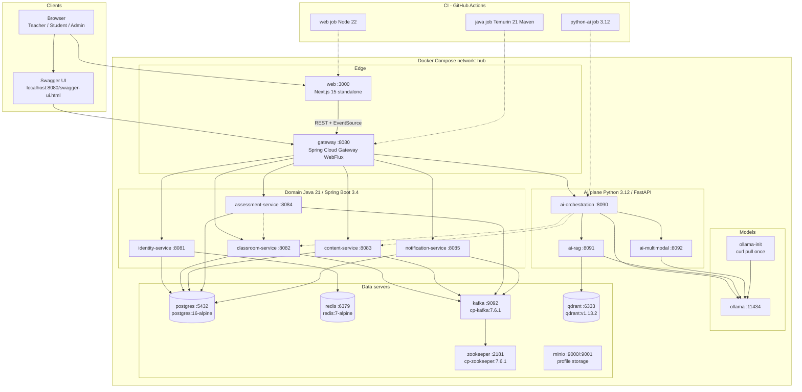
```mermaid
flowchart TB
  subgraph clients["Clients"]
    Browser["Browser<br/>Teacher / Student / Admin"]
    SwaggerUI["Swagger UI<br/>localhost:8080/swagger-ui.html"]
  end

  subgraph compose["Docker Compose network: hub"]
    subgraph edge["Edge"]
      Web["web :3000<br/>Next.js 15 standalone"]
      GW["gateway :8080<br/>Spring Cloud Gateway WebFlux"]
    end

    subgraph domain["Domain Java 21 / Spring Boot 3.4"]
      ID["identity-service :8081"]
      CR["classroom-service :8082"]
      CO["content-service :8083"]
      AS["assessment-service :8084"]
      NT["notification-service :8085"]
    end

    subgraph aiplane["AI plane Python 3.12 / FastAPI"]
      ORCH["ai-orchestration :8090"]
      RAG["ai-rag :8091"]
      MM["ai-multimodal :8092"]
    end

    subgraph models["Models"]
      OLL["ollama :11434"]
      OINIT["ollama-init<br/>curl pull once"]
    end

    subgraph data["Data servers"]
      PG[("postgres :5432<br/>postgres:16-alpine")]
      RD[("redis :6379<br/>redis:7-alpine")]
      ZK["zookeeper :2181<br/>cp-zookeeper:7.6.1"]
      KF["kafka :9092<br/>cp-kafka:7.6.1"]
      QD[("qdrant :6333<br/>qdrant:v1.13.2")]
      MINIO["minio :9000/:9001<br/>profile storage"]
    end
  end

  subgraph ci["CI - GitHub Actions"]
    CIW["web job Node 22"]
    CIJ["java job Temurin 21 Maven"]
    CIP["python-ai job 3.12"]
  end

  Browser --> Web
  Browser --> SwaggerUI
  SwaggerUI --> GW
  Web -->|"REST + EventSource"| GW
  GW --> ID
  GW --> CR
  GW --> CO
  GW --> AS
  GW --> NT
  GW --> ORCH
  ID --> PG
  ID --> RD
  CR --> PG
  CR --> KF
  CO --> PG
  CO --> KF
  AS --> PG
  AS --> KF
  AS -.-> CR
  NT --> PG
  NT --> KF
  ORCH --> RAG
  ORCH --> MM
  ORCH --> OLL
  ORCH -.-> CR
  ORCH -.-> CO
  RAG --> QD
  RAG --> OLL
  MM --> OLL
  OINIT --> OLL
  KF --> ZK
  CIW -.-> Web
  CIJ -.-> GW
  CIP -.-> ORCH
```

### 2. Request path through the gateway

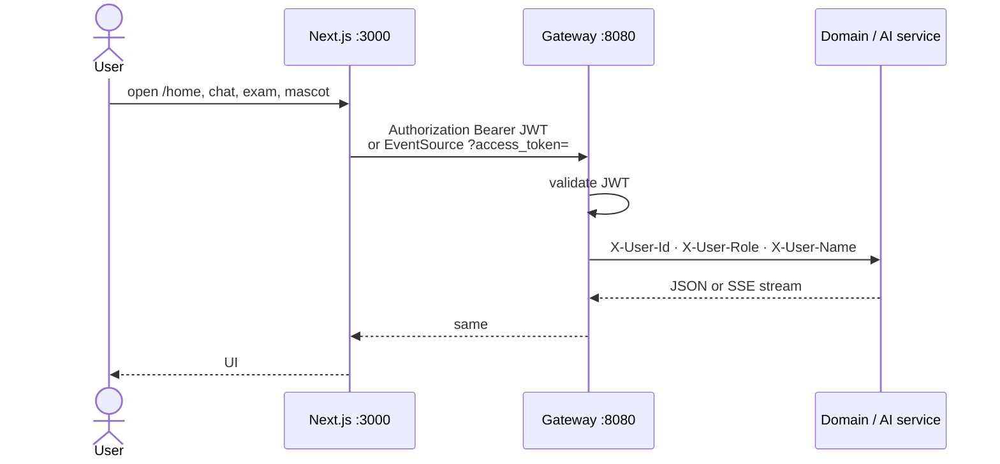
```mermaid
sequenceDiagram
  actor User
  participant Web as Next.js :3000
  participant GW as Gateway :8080
  participant Svc as Domain / AI service

  User->>Web: open /home, chat, exam, mascot
  Web->>GW: Authorization Bearer JWT<br/>or EventSource ?access_token=
  GW->>GW: validate JWT
  GW->>Svc: X-User-Id · X-User-Role · X-User-Name
  Svc-->>GW: JSON or SSE stream
  GW-->>Web: same
  Web-->>User: UI
```

Public prefixes: `/api/v1/auth/**` → identity · `/api/v1/classrooms/**` → classroom (chat SSE first) · `/api/v1/content/**` → content · `/api/v1/assessments/**` → assessment · `/api/v1/notifications/**` → notification · `/api/v1/ai/**` → orchestration (tutor stream first).

### 3. Database per service

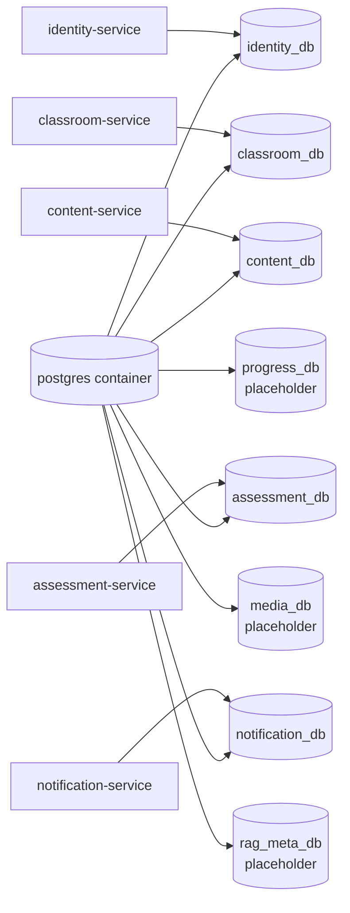
```mermaid
flowchart LR
  PG[("postgres container")]
  PG --> IDB[("identity_db")]
  PG --> CDB[("classroom_db")]
  PG --> CODB[("content_db")]
  PG --> ADB[("assessment_db")]
  PG --> NDB[("notification_db")]
  PG --> PDB[("progress_db<br/>placeholder")]
  PG --> MDB[("media_db<br/>placeholder")]
  PG --> RDB[("rag_meta_db<br/>placeholder")]

  ID["identity-service"] --> IDB
  CR["classroom-service"] --> CDB
  CO["content-service"] --> CODB
  AS["assessment-service"] --> ADB
  NT["notification-service"] --> NDB
```

Cross-service links are **UUIDs only** (no shared FKs). See [ADR 0001](docs/adr/0001-database-per-service.md).

### 4. Kafka domain events

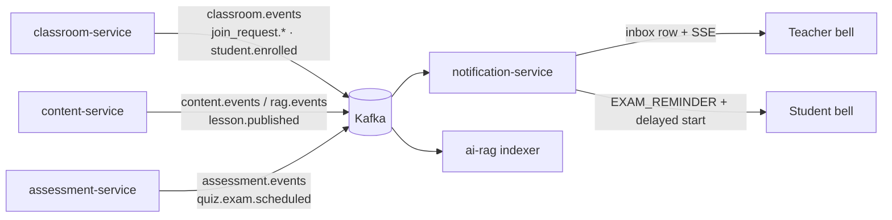
```mermaid
flowchart LR
  CR["classroom-service"] -->|"classroom.events<br/>join_request.* · student.enrolled"| KF[(Kafka)]
  CO["content-service"] -->|"content.events / rag.events<br/>lesson.published"| KF
  AS["assessment-service"] -->|"assessment.events<br/>quiz.exam.scheduled"| KF
  KF --> NT["notification-service"]
  KF --> RAG["ai-rag indexer"]
  NT -->|"inbox row + SSE"| Teacher["Teacher bell"]
  NT -->|"EXAM_REMINDER + delayed start"| Student["Student bell"]
```

Topics (`infra/kafka/topics.txt`): `classroom.events`, `content.events`, `assessment.events`, `rag.events`, `ai.events`, `user.events`.

### 5. Realtime SSE

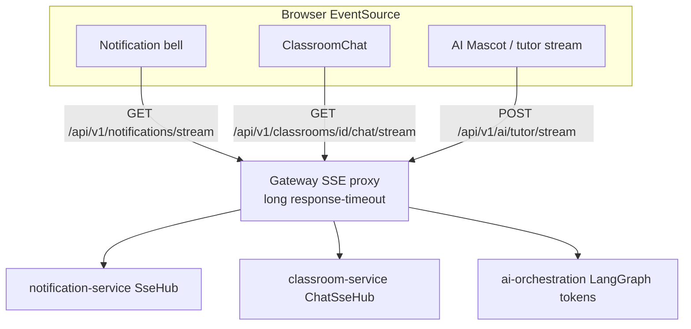
```mermaid
flowchart TB
  subgraph browser["Browser EventSource"]
    Bell["Notification bell"]
    Chat["ClassroomChat"]
    Tutor["AI Mascot / tutor stream"]
  end

  GW["Gateway SSE proxy<br/>long response-timeout"]

  Bell -->|"GET /api/v1/notifications/stream"| GW
  Chat -->|"GET /api/v1/classrooms/id/chat/stream"| GW
  Tutor -->|"POST /api/v1/ai/tutor/stream"| GW

  GW --> NT["notification-service SseHub"]
  GW --> CR["classroom-service ChatSseHub"]
  GW --> ORCH["ai-orchestration LangGraph tokens"]
```

Chat also **polls** history every ~25s if the EventSource drops.

### 6. AI plane

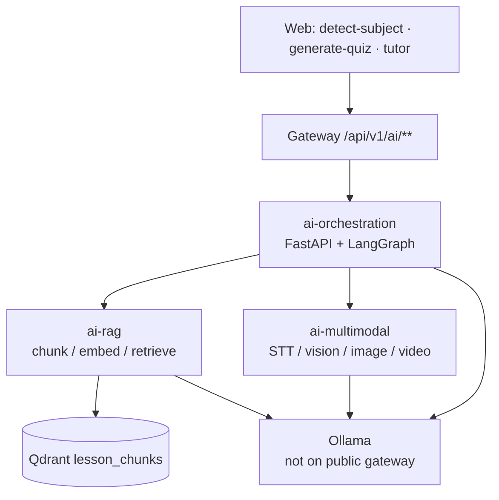
```mermaid
flowchart TB
  Web["Web: detect-subject · generate-quiz · tutor"]
  GW["Gateway /api/v1/ai/**"]
  ORCH["ai-orchestration<br/>FastAPI + LangGraph"]
  RAG["ai-rag<br/>chunk / embed / retrieve"]
  MM["ai-multimodal<br/>STT / vision / image / video"]
  OLL["Ollama<br/>not on public gateway"]
  QD[("Qdrant lesson_chunks")]

  Web --> GW --> ORCH
  ORCH --> RAG
  ORCH --> MM
  ORCH --> OLL
  RAG --> QD
  RAG --> OLL
  MM --> OLL
```

See [ADR 0002](docs/adr/0002-ai-capability-plane.md). Quiz generate is **heuristic-first**; Ollama is optional with a tight timeout.

### 7. Product screens → services

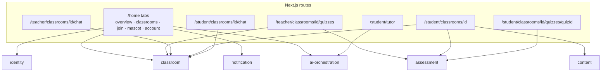
```mermaid
flowchart TB
  subgraph web["Next.js routes"]
    Home["/home tabs<br/>overview · classrooms · join · mascot · account"]
    TQuiz["/teacher/classrooms/id/quizzes"]
    TChat["/teacher/classrooms/id/chat"]
    SClass["/student/classrooms/id"]
    SChat["/student/classrooms/id/chat"]
    SExam["/student/classrooms/id/quizzes/quizId"]
    Tutor["/student/tutor"]
  end

  Home --> ID["identity"]
  Home --> CR["classroom"]
  Home --> NT["notification"]
  Home --> ORCH["ai-orchestration"]
  TQuiz --> AS["assessment"]
  TQuiz --> CR
  TChat --> CR
  SClass --> CR
  SClass --> CO["content"]
  SClass --> AS
  SChat --> CR
  SExam --> AS
  Tutor --> ORCH
```

### 8. Core journeys

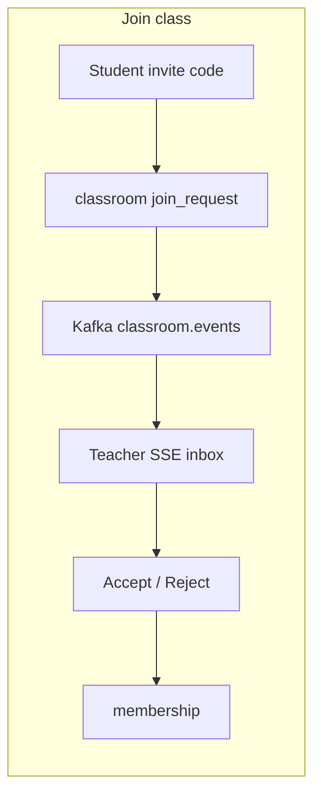
```mermaid
flowchart LR
  subgraph join["Join class"]
    J1["Student invite code"] --> J2["classroom join_request"]
    J2 --> J3["Kafka classroom.events"]
    J3 --> J4["Teacher SSE inbox"]
    J4 --> J5["Accept / Reject"]
    J5 --> J6["membership"]
  end
```

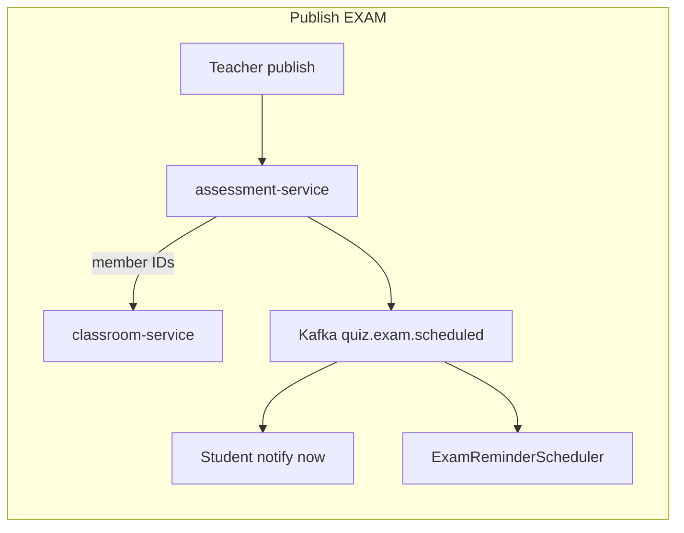
```mermaid
flowchart LR
  subgraph exam["Publish EXAM"]
    E1["Teacher publish"] --> E2["assessment-service"]
    E2 -->|"member IDs"| E3["classroom-service"]
    E2 --> E4["Kafka quiz.exam.scheduled"]
    E4 --> E5["Student notify now"]
    E4 --> E6["ExamReminderScheduler"]
  end
```

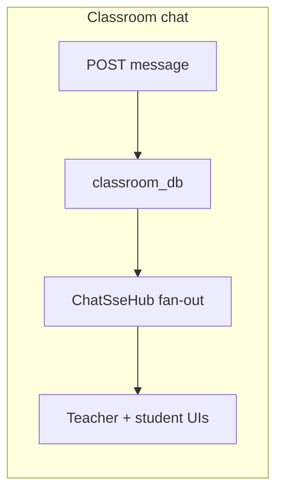
```mermaid
flowchart LR
  subgraph chat["Classroom chat"]
    C1["POST message"] --> C2["classroom_db"]
    C2 --> C3["ChatSseHub fan-out"]
    C3 --> C4["Teacher + student UIs"]
  end
```

## Service techniques

Every technique used in this app, mapped to where it runs.

### Technique map

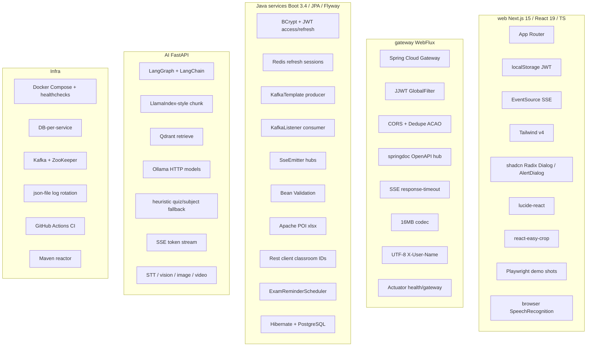
```mermaid
flowchart TB
  subgraph webtech["web Next.js 15 / React 19 / TS"]
    W1["App Router"]
    W2["localStorage JWT"]
    W3["EventSource SSE"]
    W4["Tailwind v4"]
    W5["shadcn Radix Dialog / AlertDialog"]
    W6["lucide-react"]
    W7["react-easy-crop"]
    W8["Playwright demo shots"]
    W9["browser SpeechRecognition"]
  end

  subgraph gwtech["gateway WebFlux"]
    G1["Spring Cloud Gateway"]
    G2["JJWT GlobalFilter"]
    G3["CORS + Dedupe ACAO"]
    G4["springdoc OpenAPI hub"]
    G5["SSE response-timeout"]
    G6["16MB codec"]
    G7["UTF-8 X-User-Name"]
    G8["Actuator health/gateway"]
  end

  subgraph javatech["Java services Boot 3.4 / JPA / Flyway"]
    J1["BCrypt + JWT access/refresh"]
    J2["Redis refresh sessions"]
    J3["KafkaTemplate producer"]
    J4["KafkaListener consumer"]
    J5["SseEmitter hubs"]
    J6["Bean Validation"]
    J7["Apache POI xlsx"]
    J8["Rest client classroom IDs"]
    J9["ExamReminderScheduler"]
    J10["Hibernate + PostgreSQL"]
  end

  subgraph aitech["AI FastAPI"]
    A1["LangGraph + LangChain"]
    A2["LlamaIndex-style chunk"]
    A3["Qdrant retrieve"]
    A4["Ollama HTTP models"]
    A5["heuristic quiz/subject fallback"]
    A6["SSE token stream"]
    A7["STT / vision / image / video"]
  end

  subgraph inftech["Infra"]
    I1["Docker Compose + healthchecks"]
    I2["DB-per-service"]
    I3["Kafka + ZooKeeper"]
    I4["json-file log rotation"]
    I5["GitHub Actions CI"]
    I6["Maven reactor"]
  end
```

### Full catalog

| Layer | Technique | Where | What it does |
|---|---|---|---|
| Edge | **Spring Cloud Gateway** (WebFlux, Cloud 2024.0) | `gateway` | Single public API `:8080`; path routes to all domain + AI services |
| Edge | **JJWT** `JwtAuthGlobalFilter` | `gateway` | Validates access JWT; injects `X-User-Id` / `X-User-Role` / `X-User-Name` |
| Edge | **SSE query token** | `gateway` | EventSource cannot send `Authorization` → `?access_token=` |
| Edge | **CORS + DedupeResponseHeader** | `gateway` | `localhost:3000` / `127.0.0.1:3000`; avoid duplicate `Allow-Origin` |
| Edge | **springdoc OpenAPI hub** | `gateway` | Aggregated Swagger (`01-identity` … `08-ai-multimodal`) |
| Edge | **Long SSE timeouts** | `gateway` | Inbox / chat / tutor stream `response-timeout` (minutes) |
| Edge | **16MB JSON codec** | `gateway` + classroom | Chat attachment data-URLs |
| Edge | **UTF-8 user-name encoding** | `gateway` + classroom | Vietnamese display names on chat |
| Edge | **Actuator** | `gateway`, Java services | `/actuator/health` (notification healthcheck); gateway routes info |
| Web | **Next.js 15 App Router** | `apps/web` | `/home`, teacher/student deep routes, standalone Docker |
| Web | **React 19 + TypeScript** | `apps/web` | Client components, typed API |
| Web | **Tailwind CSS v4** | `apps/web` | Utility + `globals.css` design system |
| Web | **shadcn/ui + Radix** | `apps/web` | `Dialog`, `AlertDialog` (delete confirms), `Button` |
| Web | **lucide-react** | `apps/web` | Icons (chat toolbar, header) |
| Web | **react-easy-crop** | `apps/web` | Classroom cover crop modal |
| Web | **localStorage JWT** | `apps/web` | Access token + user; `AuthGuard` |
| Web | **EventSource SSE** | `NotificationBell`, `ClassroomChat`, tutor | Inbox, chat live, token stream |
| Web | **Chat poll fallback** | `ClassroomChat` | ~25s history poll if SSE drops |
| Web | **Browser SpeechRecognition** | tutor composer | speak→text; server STT fallback |
| Web | **Client pagination** | `PaginationBar` | Classrooms, inbox, quiz lists |
| Web | **Playwright** | `scripts/capture-demo-screens.mjs` | README demo screenshots |
| Identity | **Spring Security + BCrypt** | `identity-service` | Password hash |
| Identity | **Access + refresh JWT** | `identity-service` | Login / refresh / revoke |
| Identity | **Redis sessions** | `identity-service` + `redis` | Refresh-token store |
| Identity | **Flyway + JPA/Hibernate** | `identity-service` | `identity_db` schema |
| Identity | **Profile PATCH** | `identity-service` | Name, email, grade, avatar |
| Classroom | **Invite codes + join-request FSM** | `classroom-service` | Request → Accept/Reject → member |
| Classroom | **Kafka producer** | `classroom-service` | `classroom.events` |
| Classroom | **ChatSseHub `SseEmitter`** | `classroom-service` | Per-class live chat |
| Classroom | **Chat persistence** | Flyway `V3+` | Messages, attachments, reactions, pin, edit, soft-delete |
| Content | **Lesson publish lifecycle** | `content-service` | Draft → published |
| Content | **Kafka toward RAG** | `content-service` | `content.events` / `rag.events` |
| Assessment | **DRAFT / PUBLISHED + EXAM/PRACTICE** | `assessment-service` | Kinds, schedule, time-gate |
| Assessment | **Apache POI** | `assessment-service` | `.xlsx` import/export |
| Assessment | **Classroom HTTP client** | `assessment-service` | Member student IDs on EXAM publish |
| Assessment | **Kafka `quiz.exam.scheduled`** | `assessment-service` | `assessment.events` |
| Notification | **`@KafkaListener`** | `notification-service` | `classroom.events` + `assessment.events` |
| Notification | **Inbox `SseHub`** | `notification-service` | Per-user SSE (`connected` / `notification` / `unread`) |
| Notification | **Join resolve from bell** | `notification-service` | Accept/Reject without leaving inbox |
| Notification | **`ExamReminderScheduler`** | `notification-service` | Delayed "starting soon" |
| AI | **FastAPI + Uvicorn + Pydantic** | `ai-*` | HTTP APIs |
| AI | **LangGraph + LangChain** | `ai-orchestration` | Tutor graph |
| AI | **Tutor SSE stream** | `ai-orchestration` | Token deltas to the browser |
| AI | **Heuristic-first quiz/subject** | `ai-orchestration` | Fast path; optional Ollama timeout |
| AI | **LlamaIndex-style chunking** | `ai-rag` | Lesson embeddings |
| AI | **Qdrant retrieve** | `ai-rag` + `qdrant` | Grounded tutor context |
| AI | **Ollama HTTP** | `ollama` | `llama3.2`, `llama3.2:1b`, `nomic-embed-text`; optional `llava` |
| AI | **`ollama-init` curl pull** | `ollama-init` | Models on `compose up` |
| AI | **Multimodal helpers** | `ai-multimodal` | STT / vision / image / video (+ SVG/clip fallbacks) |
| Data | **Database-per-service** | `postgres` | Isolated DBs — [ADR 0001](docs/adr/0001-database-per-service.md) |
| Data | **Flyway migrations** | all Java domain services | Versioned schema |
| Data | **Kafka + ZooKeeper** | `kafka`, `zookeeper` | Async events |
| Data | **Redis 7** | `redis` | Identity tokens |
| Data | **Qdrant** | `qdrant` | Vectors |
| Data | **MinIO** | profile `storage` | Future object storage |
| Ops | **Docker Compose** | whole stack | Healthchecks, log rotation (`json-file` 5m×2) |
| Ops | **Maven reactor** | root `pom.xml` | Java 21, Boot 3.4.2, modules |
| Ops | **GitHub Actions CI** | `.github/workflows/ci.yml` | Web tsc+build, `mvn package`, Python compile |
| Ops | **WSL2 + Docker Desktop** | Windows host | Required engine for Compose |

Kafka topics (`infra/kafka/topics.txt`): `classroom.events`, `content.events`, `assessment.events`, `rag.events`, `ai.events`, `user.events`. Flow drawings are in **Architecture** above.

### Per-service notes

### `apps/web` — Next.js portals

- **Technique:** App Router, client auth (`localStorage` JWT), role-aware **home hub** (`/home`) plus deep routes (`/teacher/classrooms/[id]/quizzes`, `/teacher/classrooms/[id]/chat`, `/student/classrooms/[id]/chat`, `/student/tutor`, take-exam).
- **Realtime:** `EventSource` to `/api/v1/notifications/stream?access_token=…` and `/api/v1/classrooms/{id}/chat/stream?access_token=…`.
- **UX:** Horizontal classroom cards + **Phòng chat**; create-classroom modal (detect-subject, cover crop); quiz authoring (kinds + AI + Excel); classroom chat (unbounded textarea, emoji, pin, edit, shadcn delete dialog); classic one-question exam UI; fireworks; Account profile; register email/password only; client pagination.
- **AI assist (client):** Subject + knowledges via `/api/v1/ai/detect-subject`; quiz MCQ via `/api/v1/ai/generate-quiz`; tutor stream + image/video/stt/vision helpers in `lib/api.ts`.

### `gateway` — Spring Cloud Gateway

- **Technique:** Reactive gateway routes `/api/v1/**` to internal services; OpenAPI aggregation for Swagger UI (`01-identity` … `08-ai-multimodal`).
- **Security:** JWT validation at the edge; downstream services trust gateway headers on the Docker network (`X-User-Id`, `X-User-Role`, UTF-8 `X-User-Name`).
- **SSE-aware:** Proxies long-lived `/api/v1/notifications/stream`, `/api/v1/classrooms/*/chat/stream`, and `/api/v1/ai/tutor/stream`.
- **Payloads:** `spring.codec.max-in-memory-size: 16MB` so chat attachments (base64 data-URLs) are not truncated.

### `identity-service`

- **Technique:** Register / login / refresh; BCrypt passwords; access + refresh JWTs; **profile** (`GET /me`, `PATCH /profile`).
- **Redis:** Refresh-token / session support for revoke & rotation.
- **Roles:** `ADMIN`, `TEACHER`, `STUDENT` seeded for demo accounts.
- **Self-register:** UI/API accepts **email + password** only. Backend defaults `role=STUDENT` and `fullName` from the email local-part (or `Người dùng`). Teachers are **not** self-selected on register — use seeded demo teachers or admin assignment; users edit display name / grade / avatar later in Account.

### `classroom-service`

- **Technique:** CRUD classrooms, invite codes, **join-request workflow** (request → Accept/Reject → membership), **members list**, **per-classroom chat**.
- **Chat:** Messages + attachments + reactions + pin + edit + soft-delete; in-memory `ChatSseHub`; Flyway `V3+` (`classroom_chat` tables).
- **Kafka producer:** Emits `join_request.created|accepted|rejected`, `student.enrolled`, `classroom.created` on `classroom.events`.
- **Authz:** Teacher owns Accept/Reject for their classrooms; students create join requests by invite code; chat requires teacher ownership or student membership (ADMIN bypass). Delete messages: TEACHER/ADMIN. Edit: sender only.

### `notification-service` — realtime inbox

- **Technique:** Persist inbox rows in Postgres; expose REST list / unread-count / mark-read / mark-all-read.
- **Kafka consumer:** Listens to `classroom.events` (join requests) and `assessment.events` (`quiz.exam.scheduled`).
- **Realtime delivery:** In-memory `SseHub` with `SseEmitter` per user; events `connected`, `notification`, `unread`.
- **Inbox actions:** Teachers can **Accept / Reject** join requests from the bell via `POST /api/v1/notifications/join-requests/{id}/resolve`.
- **Exam reminders:** On EXAM publish, notifies enrolled students immediately, then a delayed “starting soon” via `ExamReminderScheduler`.
- **Why SSE:** One-way push fits inbox UX; simpler than WebSocket for this use case — see [ADR 0003](docs/adr/0003-join-approval-notifications.md).

### `content-service`

- **Technique:** Lessons per classroom; publish lifecycle.
- **Kafka:** Publishes `lesson.published` / indexing triggers toward RAG (`rag.index.requested` style events on content/rag topics).

### `assessment-service`

- **Technique:** Quizzes per classroom with **DRAFT / PUBLISHED** lifecycle and kinds **EXAM / PRACTICE** (plus legacy **GAME** in the API enum); schedule + `sourceLabel`; MCQ + short answers; attempt grading on submit; EXAM student time-gate.
- **Authoring:** Create/update draft, publish, delete (attempts cascade), Excel import/export (`.xlsx`).
- **Classroom client:** On EXAM publish, loads member student IDs from `classroom-service` and emits `quiz.exam.scheduled` on `assessment.events`.
- **Kafka:** Emits quiz lifecycle events for notifications / downstream consumers.

### AI plane (`ai/*`) — see [ADR 0002](docs/adr/0002-ai-capability-plane.md)

| Service | Technique |
|---|---|
| **`ai-orchestration`** | FastAPI + **LangGraph** tutor graph; `detect-subject`; `generate-quiz` (heuristic-first); tutor REST + **SSE stream**; text→image / text→video / STT / vision |
| **`ai-rag`** | LlamaIndex-style chunking/embeddings; **Qdrant** vector store; retrieval for grounded tutor answers |
| **`ai-multimodal`** | STT / vision / image helpers (Ollama-backed where configured; offline SVG card / clip fallbacks) |
| **`ollama`** | Private model runtime (`llama3.2`, `llama3.2:1b` quiz/tutor fast path, `nomic-embed-text` via `ollama-init`; optional `llava` for vision) |

### Data & infra

| Component | Technique |
|---|---|
| **PostgreSQL** | One logical DB per service (init SQL under `infra/docker/postgres`) |
| **Redis** | Identity refresh/session support |
| **Kafka + ZooKeeper** | Async domain events between classroom/content/assessment and notification/RAG |
| **Qdrant** | Vector search for lesson chunks |
| **MinIO** (optional profile `storage`) | S3-compatible object storage for future media |

## Repository layout

```text
apps/web                 Next.js portals (home hub / teacher / student / tutor / classroom chat)
gateway                  Spring Cloud Gateway (JWT + routing + Swagger hub)
services/*               Domain Spring Boot services
ai/*                     LangGraph / RAG / multimodal Python sidecars
packages/events          Event JSON schemas
infra/                   Postgres init, Kafka topics
docs/adr                 Architecture decision records
docs/demo                README demo screenshots (Playwright)
scripts/                 Docker helpers + capture-demo-screens.mjs
docker-compose.yml       Local full stack
.github/workflows/ci.yml Web typecheck/build · Maven · Python compile
```

## API map (via Gateway `:8080`)

| Method | Path | Service |
|---|---|---|
| POST | `/api/v1/auth/login` | identity |
| POST | `/api/v1/auth/register` | identity (email + password → default STUDENT) |
| POST | `/api/v1/auth/refresh` | identity |
| GET | `/api/v1/auth/me` | identity |
| PATCH | `/api/v1/auth/profile` | identity (name, email, grade, avatar) |
| GET/POST | `/api/v1/classrooms` | classroom |
| GET | `/api/v1/classrooms/{id}` | classroom |
| DELETE | `/api/v1/classrooms/{id}` | classroom (owning teacher/ADMIN; hard-delete cascades members + join requests) |
| GET | `/api/v1/classrooms/{id}/members` | classroom |
| POST | `/api/v1/classrooms/join-requests` | classroom (student request) |
| GET | `/api/v1/classrooms/{id}/join-requests` | classroom (teacher pending) |
| GET | `/api/v1/classrooms/join-requests/mine` | classroom (student) |
| POST | `/api/v1/classrooms/join-requests/{id}/accept\|reject` | classroom |
| GET | `/api/v1/classrooms/{id}/chat/messages` | classroom (paginated history; `before`, `limit`; includes pinned strip) |
| POST | `/api/v1/classrooms/{id}/chat/messages` | classroom (text + optional attachments) |
| PATCH | `/api/v1/classrooms/{id}/chat/messages/{messageId}` | classroom (edit own text) |
| POST | `/api/v1/classrooms/{id}/chat/messages/{messageId}/pin` | classroom (toggle pin) |
| DELETE | `/api/v1/classrooms/{id}/chat/messages/{messageId}/pin` | classroom (unpin) |
| DELETE | `/api/v1/classrooms/{id}/chat/messages/{messageId}` | classroom (**TEACHER/ADMIN** soft-delete) |
| POST | `/api/v1/classrooms/{id}/chat/messages/{messageId}/reactions` | classroom (emoji toggle) |
| GET | `/api/v1/classrooms/{id}/chat/stream` | classroom (**SSE** live updates) |
| GET | `/api/v1/notifications` | notification (inbox) |
| GET | `/api/v1/notifications/unread-count` | notification |
| POST | `/api/v1/notifications/{id}/read` | notification |
| POST | `/api/v1/notifications/read-all` | notification |
| POST | `/api/v1/notifications/join-requests/{id}/resolve` | notification (Accept/Reject from bell) |
| GET | `/api/v1/notifications/stream` | notification (**SSE**) |
| GET/POST | `/api/v1/content/lessons` | content |
| POST | `/api/v1/content/lessons/{id}/publish` | content |
| GET/POST | `/api/v1/assessments/quizzes` | assessment (draft create; students list PUBLISHED only) |
| PUT | `/api/v1/assessments/quizzes/{id}` | assessment (update title + questions) |
| DELETE | `/api/v1/assessments/quizzes/{id}` | assessment (owner teacher/ADMIN; attempts cascade) |
| POST | `/api/v1/assessments/quizzes/{id}/publish` | assessment |
| POST | `/api/v1/assessments/quizzes/import` | assessment (multipart `.xlsx` → draft) |
| GET | `/api/v1/assessments/quizzes/{id}/export` | assessment (`.xlsx` Q&A) |
| GET | `/api/v1/assessments/quizzes/{id}/attempts` | assessment (teacher results) |
| POST | `/api/v1/assessments/quizzes/{id}/submit` | assessment |
| POST | `/api/v1/ai/detect-subject` | ai-orchestration (subject + knowledges) |
| POST | `/api/v1/ai/generate-quiz` | ai-orchestration (MCQ; heuristic-first) |
| POST | `/api/v1/ai/tutor` | ai-orchestration |
| POST | `/api/v1/ai/tutor/stream` | ai-orchestration (**SSE**) |
| POST | `/api/v1/ai/tutor/image` | ai-orchestration (text→image) |
| POST | `/api/v1/ai/tutor/video` | ai-orchestration (text→video) |
| POST | `/api/v1/ai/tutor/stt` | ai-orchestration (speech→text fallback) |
| POST | `/api/v1/ai/tutor/vision` | ai-orchestration (image→text) |

## Local AI-only (Python, no Docker)

Useful when Docker/Java/Node are not installed yet:

```powershell
cd ai\orchestration
python -m venv .venv
.\.venv\Scripts\activate
pip install -r requirements.txt
uvicorn app.main:app --reload --port 8090
```

## Architecture notes

Drawings live in **Architecture** (every Compose server + CI, gateway path, DBs, Kafka, SSE, AI plane, screens, journeys). Techniques are listed in **Service techniques** (map + full catalog).

- Gateway validates JWT and forwards `X-User-Id` / `X-User-Role` / `X-User-Name`
- Domain services trust gateway headers (internal network)
- Join approvals are **request → teacher decision → membership**, with Kafka + SSE notifications
- Quizzes are **draft → publish**; students only attempt published exams; EXAM publish fans out reminders
- Classroom chat is **one room per class** with SSE + poll fallback
- Tutor / mascot is **class-bound** (Theo lớp) with multimodal stream endpoints behind the gateway
- Ollama is **not** publicly routed

See `docs/adr` for deeper decisions.

## Phase status

| Phase | Status |
|---|---|
| 0–1 Foundation (compose, identity, gateway, web shell) | Implemented |
| 2 Teaching core (classroom, content, assessment + Excel/AI quizzes) | Implemented (MVP) |
| 3 AI plane (LangGraph + RAG + multimodal tutor/mascot) | Implemented (MVP) |
| 4 Notifications (Kafka + SSE inbox, join Accept/Reject, exam reminders) | Implemented (MVP) |
| 5 Home hub UX (rail tabs, account, register defaults, pagination) | Implemented (MVP) |
| 6 Classroom chat (SSE room, attachments, pin/edit/react, shadcn delete) | Implemented (MVP) |
| 7 Games, progress analytics, K8s hardening | Scaffold / next |

## License

Private / proprietary unless otherwise stated.
