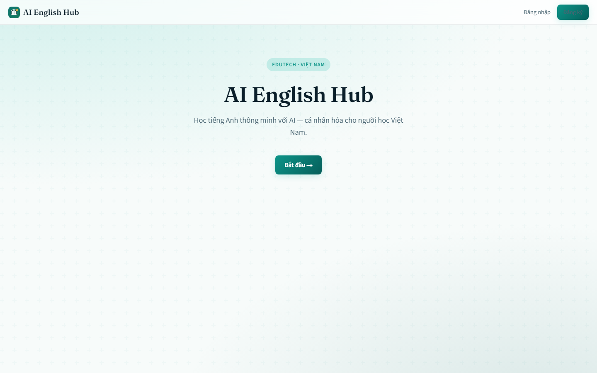
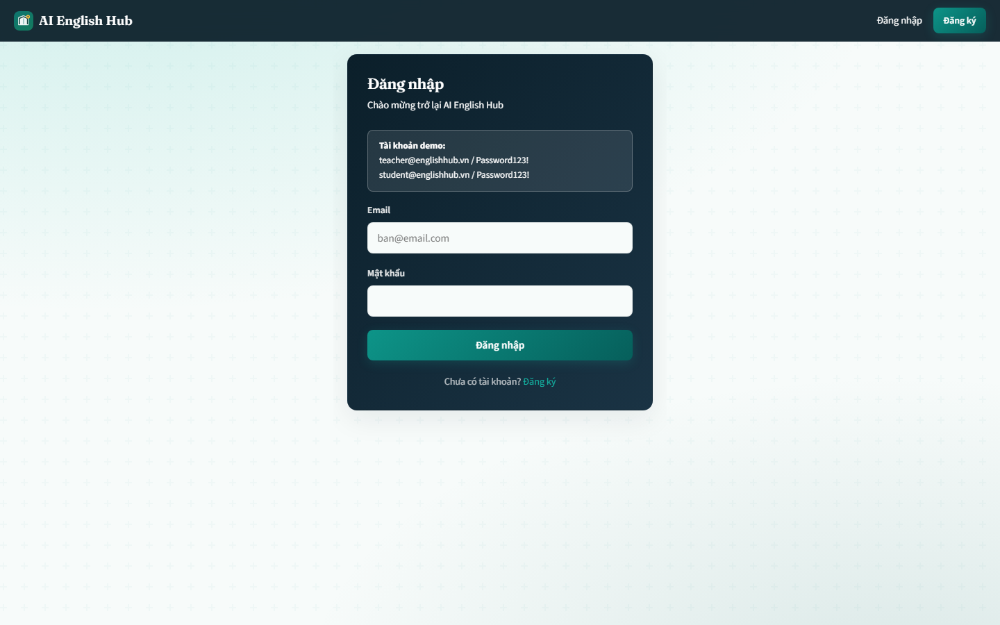
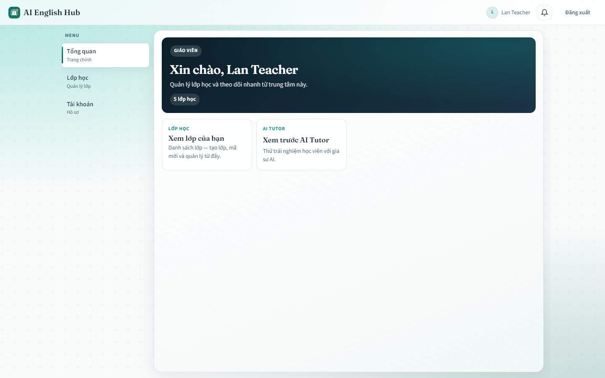
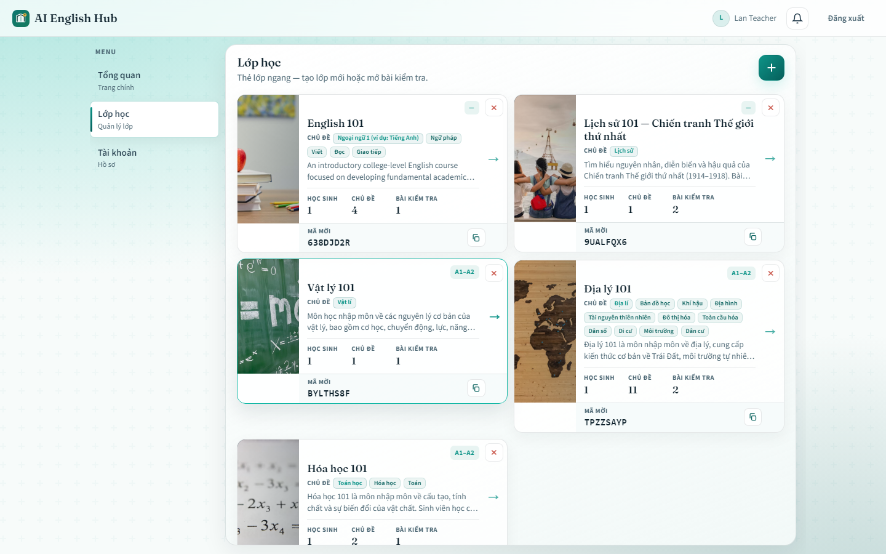
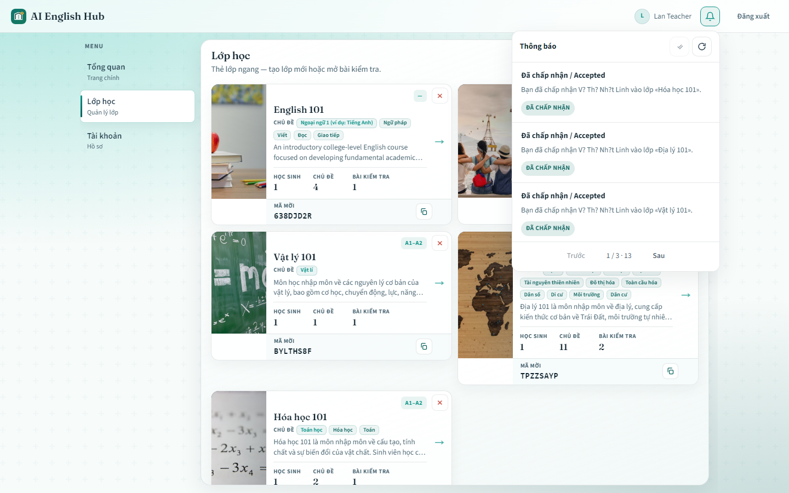
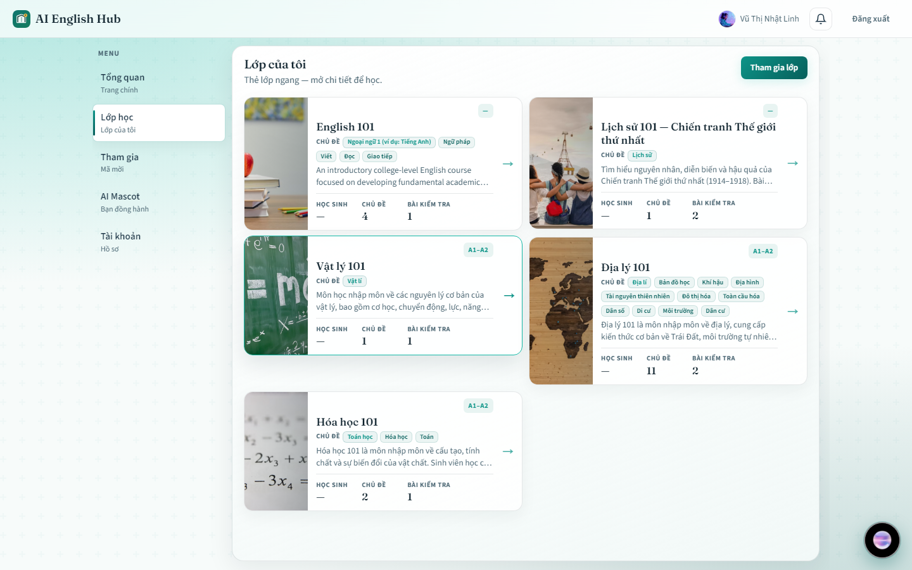
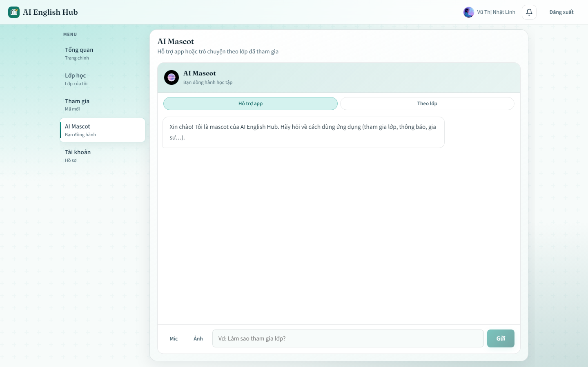
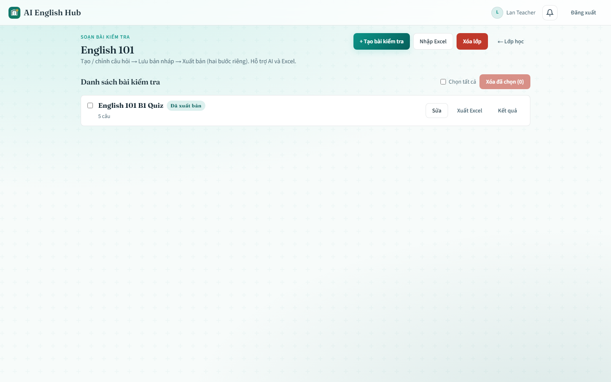
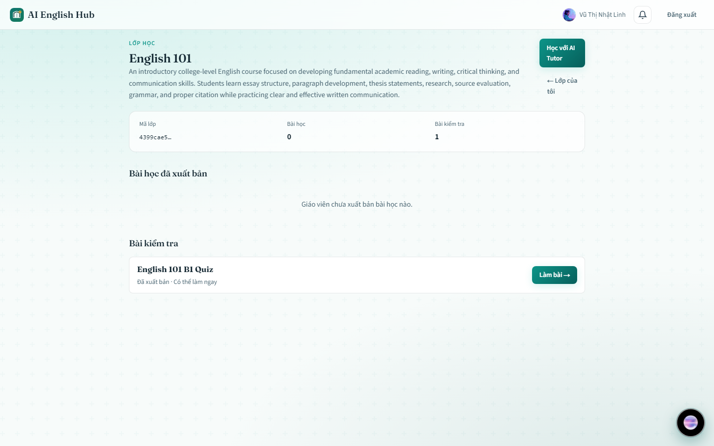
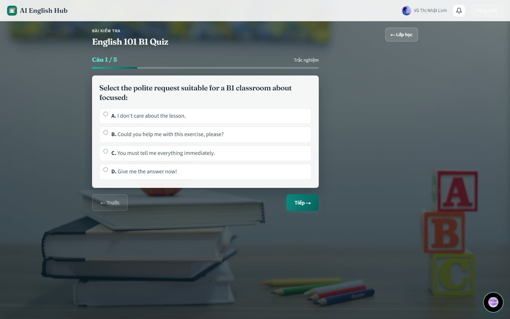

# AI English Hub

Production-oriented EduTech monorepo for Vietnamese students learning English (and school subjects) with multimodal AI.

**Stack:** Next.js · Spring Boot microservices · PostgreSQL · Redis · Kafka · Qdrant · Ollama · LangGraph · LlamaIndex-style RAG · Docker · SSE realtime notifications

## Demo screenshots

Captured from the local Docker stack (`localhost:3000`) against the current home-hub UX. Regenerate (stack must be up):

```powershell
npm install --no-save playwright@1.49.0
npx playwright install chromium
node scripts/capture-demo-screens.mjs
```

### Landing & auth





### Home hub (teacher)

After login, both roles land on **`/home`** (left rail). `/dashboard` redirects here. Classroom list pages `/teacher/classrooms` and `/student/classrooms` redirect to `/home?tab=classrooms`.





### Realtime notifications (SSE)

Teacher inbox with one-click **Accept / Reject** on join requests (no reason prompt). Refresh and mark-read are icon actions; long lists use pagination.



### Home hub (student)







### Quizzes & exams







## Product UX (current)

### Home hub — `/home`

Single app shell with a **left rail** (`?tab=`):

| Tab | Teacher / Admin | Student |
|---|---|---|
| **Tổng quan** (`overview`) | Quick tiles → classrooms (and tutor preview for teachers) | Tiles → classrooms, join, AI Mascot |
| **Lớp học** (`classrooms`) | Manage / create classes | Joined classes |
| **Tham gia** (`join`) | — | Invite-code join request |
| **AI Mascot** (`mascot`) | — | Embedded chat (+ floating mascot on other tabs) |
| **Tài khoản** (`account`) | Profile edit | Profile edit |

- `/dashboard` → `/home`
- `/teacher/classrooms` and `/student/classrooms` → `/home?tab=classrooms` (no duplicate list UIs)
- Shared **pagination** (`PaginationBar`) on classroom lists, notification inbox, and teacher quiz lists

### Classrooms

Horizontal cards show: **cover**, **title**, **description**, **level** (CEFR / band when inferred), **students**, **subjects + knowledges** (all topic chips; **Khác / Other** hidden), **exam count**, and for teachers **invite code + copy**.

**Create classroom** (modal):

- AI / heuristic **subject + knowledges** from description (`/api/v1/ai/detect-subject`)
- Subject picker aligned with **Lớp 12**-style curriculum groups (Ngữ văn, Toán, Ngoại ngữ, KHTN, KHXH, Công nghệ & nghệ thuật, IELTS/TOEIC, …)
- Cartoon cover: preset / upload / AI generate + **crop** dialog

Teachers open a class → quiz authoring; students open a class → lessons, published exams, tutor deep-link.

### Quizzes / exams

**Teacher** (`/teacher/classrooms/[id]/quizzes`):

- Create/edit **draft** quizzes; **Publish** is a separate action (students only see `PUBLISHED`)
- **AI MCQ generate** via `/api/v1/ai/generate-quiz` (fast heuristic by default; Ollama optional)
- **Excel** `.xlsx` **import** (→ draft) and **export**
- Bulk / single delete; view attempt results; optional **delete classroom** (cascades quizzes)

**Student** (`/student/classrooms/[id]/quizzes/[quizId]`):

- One question per screen (Tiếp / Trước / Nộp bài)
- Classroom **cover as exam background**
- **Fireworks** overlay when score equals max score

### AI Mascot / Tutor

- Two modes: **Hỗ trợ app** (how to use the product) and **Theo lớp** (class-bound tutor)
- Class-bound chat with **history** (last turns sent to the API)
- **Streaming** replies (`POST /api/v1/ai/tutor/stream`, SSE)
- Multimodal: **text↔image**, **image→text** (vision), **text→video**, **speak→text** (browser STT + server fallback), **speak→image**
- Vietnamese responses when the user / class context is Vietnamese; English-focused for English/IELTS/TOEIC subjects
- Students: home tab **AI Mascot** + floating host; full surface also at `/student/tutor`

### Account — `/home?tab=account`

Edit **full name**, **email**, **grade** (Lớp 6–12 / Đại học / …), and **avatar** (`PATCH /api/v1/auth/profile`).

### Register — `/register`

**Email + password** only → defaults to **`STUDENT`**. Display name derived from email local-part (editable later in Account). Teachers use seeded demos or admin assignment — not self-selected on register.

## Quick start (Docker)

Prerequisites:
1. [Docker Desktop](https://www.docker.com/products/docker-desktop/)
2. **WSL 2** (required on Windows — without it you get `500 Internal Server Error` from the Docker engine)
3. Docker Desktop status: **Engine running**

If `docker compose up --build` fails with API 500 / engine errors, run an **Admin** PowerShell once:

```powershell
cd "c:\Users\LvLin\OneDrive\Documents\AI\AI English Hub & Multimodal App"
Set-ExecutionPolicy -Scope Process Bypass -Force
.\scripts\fix-docker-windows.ps1
# Reboot if WSL was just installed, then open Docker Desktop and wait for Engine running
```

Then build & start **detached** (recommended — avoids endless container log spam):

```powershell
cd "c:\Users\LvLin\OneDrive\Documents\AI\AI English Hub & Multimodal App"
copy .env.example .env
.\scripts\up.ps1 -Build
# or: docker compose up -d --build
```

Optional MinIO object storage:

```powershell
docker compose --profile storage up -d
```

Follow only the services you care about:

```powershell
docker compose logs -f --tail=80 web gateway
```

| Surface | URL |
|---|---|
| Web app | http://localhost:3000 |
| **Swagger hub (all APIs)** | http://localhost:8080/swagger-ui.html |
| API Gateway | http://localhost:8080 |
| Qdrant | http://localhost:6333 |
| Ollama | http://localhost:11434 |
| MinIO console (profile `storage`) | http://localhost:9001 |

Models are pulled automatically by `ollama-init` on `docker compose up`.  
If you need a manual pull (and `docker compose exec` fails with Docker API 500), use HTTP instead:

```powershell
# Restart Docker Desktop if you see: "request returned 500 Internal Server Error"
docker compose up -d ollama
.\scripts\pull-models.ps1
```

Full Swagger guide: [`docs/swagger.md`](docs/swagger.md)

### Demo accounts

| Role | Email | Password |
|---|---|---|
| Admin | `admin@englishhub.vn` | `Password123!` |
| Teacher | `teacher@englishhub.vn` | `Password123!` |
| Student | `student@englishhub.vn` | `Password123!` |

### Smoke flow

1. Login as **teacher** → `/home` → **Lớp học** → create classroom (AI subject/knowledges + cover) → **copy invite code**
2. Login as **student** → `/home` → **Tham gia** → join with invite code
3. Teacher **Accept / Reject** from the **notification bell** (or pending join list)
4. Teacher opens class → create quiz (AI generate and/or Excel) → **save draft** → **Publish**
5. Student opens class → take exam (one question per screen) → perfect score shows fireworks
6. Student opens **AI Mascot** (or `/student/tutor`) — app help or class-bound multimodal chat

### Ops tips

**DBeaver → Postgres (Docker):** host `localhost`, port `5432`, user/password from `.env` (defaults `englishhub` / `englishhub`). Connect to a **service DB** (e.g. `identity_db`, `classroom_db`, `assessment_db`) — not only the bootstrap `POSTGRES_DB`. See `infra/docker/postgres/init-databases.sql`.

**Kafka `NodeExists` on recreate:** if Kafka exits with ZooKeeper `NodeExists` on `/brokers/ids/1` (stale broker registration), recycle broker + ZK only — **do not wipe Postgres**:

```powershell
docker compose stop kafka zookeeper
docker compose rm -f kafka zookeeper
docker compose up -d zookeeper
# wait until healthy, then:
docker compose up -d kafka
docker compose up -d
```

## Services

| Layer | Service | Port (internal) | Role |
|---|---|---|---|
| Edge | `gateway` | 8080 | JWT, routing, Swagger aggregation, SSE proxy |
| Web | `apps/web` | 3000 | Next.js home hub + teacher/student deep routes |
| Domain | `identity-service` | 8081 | Auth, JWT, profile, Redis sessions |
| Domain | `classroom-service` | 8082 | Classrooms, invite codes, join requests, members |
| Domain | `content-service` | 8083 | Lessons + publish lifecycle |
| Domain | `assessment-service` | 8084 | Quizzes (draft/publish), Excel, attempts |
| Domain | `notification-service` | 8085 | Inbox + SSE; Kafka consumer on `classroom.events` |
| AI | `ai-orchestration` | 8090 | LangGraph tutor, detect-subject, generate-quiz, multimodal façade |
| AI | `ai-rag` | 8091 | Chunk/embed + Qdrant retrieval |
| AI | `ai-multimodal` | 8092 | STT / vision / image / video helpers |
| Models | `ollama` (+ `ollama-init`) | 11434 | Private LLM / embeddings (`llama3.2`, `llama3.2:1b`, `nomic-embed-text`) |
| Data | Postgres / Redis / Kafka / Qdrant | — | Persistence, cache, events, vectors |
| Optional | MinIO (`storage` profile) | 9000/9001 | S3-compatible object storage |

Planned later: `game-service`, `progress-service`, `media-service` (see [`services/README.md`](services/README.md)).

## Service techniques

How each service works and the techniques it uses.

### Cross-cutting patterns

| Technique | Where | Purpose |
|---|---|---|
| **API Gateway + JWT** | `gateway` | Single public entry (`:8080`); validates JWT; injects `X-User-Id` / `X-User-Role` |
| **Database-per-service** | Postgres DBs | Isolation per bounded context (`identity_db`, `classroom_db`, …) — see [ADR 0001](docs/adr/0001-database-per-service.md) |
| **Flyway migrations** | Java services | Schema versioning per service |
| **Kafka domain events** | classroom / content / assessment → notification / RAG | Async decoupling for join approvals, enrollments, indexing |
| **SSE (Server-Sent Events)** | notification-service ↔ web; tutor stream | Realtime inbox push; streaming tutor tokens |
| **Ollama (private LLM)** | AI plane | Local models; **not** exposed via the public gateway |
| **Docker Compose** | whole stack | One-command local runtime; detached start + log rotation |

Kafka topic conventions (`infra/kafka/topics.txt`): `classroom.events`, `content.events`, `assessment.events`, `rag.events`, `ai.events`, `user.events`.

```text
Browser (Next.js)
   │  REST + EventSource(SSE)
   ▼
Spring Cloud Gateway  ──JWT──►  Domain services (Java)
                                     │ Kafka
                                     ▼
                              notification-service (SSE fan-out)
AI Tutor ──► gateway /api/v1/ai/** ──► ai-orchestration (LangGraph)
                                            ├─ ai-rag (Qdrant)
                                            ├─ ai-multimodal (STT / vision / image / video)
                                            └─ Ollama
```

### `apps/web` — Next.js portals

- **Technique:** App Router, client auth (`localStorage` JWT), role-aware **home hub** (`/home`) plus deep routes (`/teacher/classrooms/[id]/quizzes`, `/student/tutor`, take-exam).
- **Realtime:** `EventSource` to `/api/v1/notifications/stream?access_token=…` (SSE cannot send `Authorization` headers reliably).
- **UX:** Horizontal classroom cards; create-classroom modal (detect-subject, cover crop); quiz authoring (AI + Excel); one-question exam + fireworks; Account profile; register email/password only; client pagination.
- **AI assist (client):** Subject + knowledges via `/api/v1/ai/detect-subject`; quiz MCQ via `/api/v1/ai/generate-quiz`; tutor stream + image/video/stt/vision helpers in `lib/api.ts`.

### `gateway` — Spring Cloud Gateway

- **Technique:** Reactive gateway routes `/api/v1/**` to internal services; OpenAPI aggregation for Swagger UI.
- **Security:** JWT validation at the edge; downstream services trust gateway headers on the Docker network.
- **SSE-aware:** Proxies long-lived `/api/v1/notifications/stream` and `/api/v1/ai/tutor/stream` connections.

### `identity-service`

- **Technique:** Register / login / refresh; BCrypt passwords; access + refresh JWTs; **profile** (`GET /me`, `PATCH /profile`).
- **Redis:** Refresh-token / session support for revoke & rotation.
- **Roles:** `ADMIN`, `TEACHER`, `STUDENT` seeded for demo accounts.
- **Self-register:** UI/API accepts **email + password** only. Backend defaults `role=STUDENT` and `fullName` from the email local-part (or `Người dùng`). Teachers are **not** self-selected on register — use seeded demo teachers or admin assignment; users edit display name / grade / avatar later in Account.

### `classroom-service`

- **Technique:** CRUD classrooms, invite codes, **join-request workflow** (request → Accept/Reject → membership), **members list**.
- **Kafka producer:** Emits `join_request.created|accepted|rejected`, `student.enrolled`, `classroom.created` on `classroom.events`.
- **Authz:** Teacher owns Accept/Reject for their classrooms; students create join requests by invite code.

### `notification-service` — realtime inbox

- **Technique:** Persist inbox rows in Postgres; expose REST list / unread-count / mark-read / mark-all-read.
- **Kafka consumer:** Listens to `classroom.events` and creates notifications for teachers (join requests) and students (accepted/rejected).
- **Realtime delivery:** In-memory `SseHub` with `SseEmitter` per user; events `connected`, `notification`, `unread`.
- **Inbox actions:** Teachers can **Accept / Reject** join requests from the bell via `POST /api/v1/notifications/join-requests/{id}/resolve`.
- **Why SSE:** One-way push fits inbox UX; simpler than WebSocket for this use case — see [ADR 0003](docs/adr/0003-join-approval-notifications.md).

### `content-service`

- **Technique:** Lessons per classroom; publish lifecycle.
- **Kafka:** Publishes `lesson.published` / indexing triggers toward RAG (`rag.index.requested` style events on content/rag topics).

### `assessment-service`

- **Technique:** Quizzes per classroom with **DRAFT / PUBLISHED** lifecycle; MCQ + short answers; attempt grading on submit.
- **Authoring:** Create/update draft, publish, delete (attempts cascade), Excel import/export (`.xlsx`).
- **Kafka:** Emits quiz lifecycle events for progress / downstream consumers.

### AI plane (`ai/*`) — see [ADR 0002](docs/adr/0002-ai-capability-plane.md)

| Service | Technique |
|---|---|
| **`ai-orchestration`** | FastAPI + **LangGraph** tutor graph; `detect-subject`; `generate-quiz` (heuristic-first); tutor REST + **SSE stream**; text→image / text→video / STT / vision |
| **`ai-rag`** | LlamaIndex-style chunking/embeddings; **Qdrant** vector store; retrieval for grounded tutor answers |
| **`ai-multimodal`** | STT / vision / image helpers (Ollama-backed where configured; offline SVG card / clip fallbacks) |
| **`ollama`** | Private model runtime (`llama3.2`, `llama3.2:1b` quiz/tutor fast path, `nomic-embed-text` via `ollama-init`; optional `llava` for vision) |

### Data & infra

| Component | Technique |
|---|---|
| **PostgreSQL** | One logical DB per service (init SQL under `infra/docker/postgres`) |
| **Redis** | Identity refresh/session support |
| **Kafka + ZooKeeper** | Async domain events between classroom/content/assessment and notification/RAG |
| **Qdrant** | Vector search for lesson chunks |
| **MinIO** (optional profile `storage`) | S3-compatible object storage for future media |

## Repository layout

```text
apps/web                 Next.js portals (home hub / teacher / student / tutor)
gateway                  Spring Cloud Gateway (JWT + routing + Swagger hub)
services/*               Domain Spring Boot services
ai/*                     LangGraph / RAG / multimodal Python sidecars
packages/events          Event JSON schemas
infra/                   Postgres init, Kafka topics
docs/adr                 Architecture decision records
docs/demo                README demo screenshots
scripts/                 Docker helpers + capture-demo-screens.mjs
docker-compose.yml       Local full stack
.github/workflows/ci.yml Web typecheck/build · Maven · Python compile
```

## API map (via Gateway `:8080`)

| Method | Path | Service |
|---|---|---|
| POST | `/api/v1/auth/login` | identity |
| POST | `/api/v1/auth/register` | identity (email + password → default STUDENT) |
| POST | `/api/v1/auth/refresh` | identity |
| GET | `/api/v1/auth/me` | identity |
| PATCH | `/api/v1/auth/profile` | identity (name, email, grade, avatar) |
| GET/POST | `/api/v1/classrooms` | classroom |
| GET | `/api/v1/classrooms/{id}` | classroom |
| DELETE | `/api/v1/classrooms/{id}` | classroom (owning teacher/ADMIN; hard-delete cascades members + join requests) |
| GET | `/api/v1/classrooms/{id}/members` | classroom |
| POST | `/api/v1/classrooms/join-requests` | classroom (student request) |
| GET | `/api/v1/classrooms/{id}/join-requests` | classroom (teacher pending) |
| GET | `/api/v1/classrooms/join-requests/mine` | classroom (student) |
| POST | `/api/v1/classrooms/join-requests/{id}/accept\|reject` | classroom |
| GET | `/api/v1/notifications` | notification (inbox) |
| GET | `/api/v1/notifications/unread-count` | notification |
| POST | `/api/v1/notifications/{id}/read` | notification |
| POST | `/api/v1/notifications/read-all` | notification |
| POST | `/api/v1/notifications/join-requests/{id}/resolve` | notification (Accept/Reject from bell) |
| GET | `/api/v1/notifications/stream` | notification (**SSE**) |
| GET/POST | `/api/v1/content/lessons` | content |
| POST | `/api/v1/content/lessons/{id}/publish` | content |
| GET/POST | `/api/v1/assessments/quizzes` | assessment (draft create; students list PUBLISHED only) |
| PUT | `/api/v1/assessments/quizzes/{id}` | assessment (update title + questions) |
| DELETE | `/api/v1/assessments/quizzes/{id}` | assessment (owner teacher/ADMIN; attempts cascade) |
| POST | `/api/v1/assessments/quizzes/{id}/publish` | assessment |
| POST | `/api/v1/assessments/quizzes/import` | assessment (multipart `.xlsx` → draft) |
| GET | `/api/v1/assessments/quizzes/{id}/export` | assessment (`.xlsx` Q&A) |
| GET | `/api/v1/assessments/quizzes/{id}/attempts` | assessment (teacher results) |
| POST | `/api/v1/assessments/quizzes/{id}/submit` | assessment |
| POST | `/api/v1/ai/detect-subject` | ai-orchestration (subject + knowledges) |
| POST | `/api/v1/ai/generate-quiz` | ai-orchestration (MCQ; heuristic-first) |
| POST | `/api/v1/ai/tutor` | ai-orchestration |
| POST | `/api/v1/ai/tutor/stream` | ai-orchestration (**SSE**) |
| POST | `/api/v1/ai/tutor/image` | ai-orchestration (text→image) |
| POST | `/api/v1/ai/tutor/video` | ai-orchestration (text→video) |
| POST | `/api/v1/ai/tutor/stt` | ai-orchestration (speech→text fallback) |
| POST | `/api/v1/ai/tutor/vision` | ai-orchestration (image→text) |

## Local AI-only (Python, no Docker)

Useful when Docker/Java/Node are not installed yet:

```powershell
cd ai\orchestration
python -m venv .venv
.\.venv\Scripts\activate
pip install -r requirements.txt
uvicorn app.main:app --reload --port 8090
```

## Architecture notes

- Gateway validates JWT and forwards `X-User-Id` / `X-User-Role`
- Domain services trust gateway headers (internal network)
- Join approvals are **request → teacher decision → membership**, with Kafka + SSE notifications
- Quizzes are **draft → publish**; students only attempt published exams
- Tutor / mascot is **class-bound** (Theo lớp) with multimodal stream endpoints behind the gateway
- Ollama is **not** publicly routed

See `docs/adr` for deeper decisions.

## Phase status

| Phase | Status |
|---|---|
| 0–1 Foundation (compose, identity, gateway, web shell) | Implemented |
| 2 Teaching core (classroom, content, assessment + Excel/AI quizzes) | Implemented (MVP) |
| 3 AI plane (LangGraph + RAG + multimodal tutor/mascot) | Implemented (MVP) |
| 4 Notifications (Kafka + SSE inbox, join Accept/Reject) | Implemented (MVP) |
| 5 Home hub UX (rail tabs, account, register defaults, pagination) | Implemented (MVP) |
| 6 Games, progress analytics, K8s hardening | Scaffold / next |

## License

Private / proprietary unless otherwise stated.
